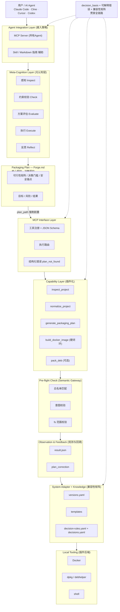

# ForgeKit Design

> 版本：v0.1 规划稿（多端扩展版）
> 前置依赖：[REQUIREMENTS.md](./REQUIREMENTS.md)
> 本文回答：ForgeKit 的多端框架为什么这样设计，以及多端扩展路线如何分阶段落地。

## 1. 设计结论

ForgeKit v0.1 应采用“**契约优先、本地优先、MCP 主接入、能力收窄**”的架构。核心是证明：AI Agent 能通过一份**可审查、可决策、可观测的交付契约**，把代码可靠推进到可分发产物。

不建议第一版做完整发布平台，也不建议同时支持多语言、多发行版、多包格式。第一版只需要证明：

1. Agent 可以稳定发现和调用工具（MCP）。
2. 工具执行前必须存在 `Forge.md` 决策契约（强制 Plan-before-build）。
3. 工具能在本地生成可验证产物，并输出 `result.json` 结构化观测。
4. 失败时能返回可读原因，并触发 `plan_correction` 回溯而非盲目重试。
5. 每次构建都返回 `decision_basis`，解释"为什么这么构建"。

> **差异化定位（市场调研方向二）**：现有 MCP Server 多为 API 转发器，缺"决策 + 观测"。ForgeKit 的 `Forge.md` + `decision-rules.yaml` + `result.json` 三件套正是这一空白的填补，应作为招牌能力贯穿全链路（见 §3.7 观测与回溯层、§10.2 语义安全锚点）。

## 2. 架构原则

| 原则 | 含义 |
|------|------|
| Local-first | v0.1 在用户本地执行，不依赖云服务和复杂账号体系 |
| Agent-native | 工具 Schema、错误、结果都面向 Agent 调用设计 |
| Protocol-pragmatic | 先支持 MCP 等已有协议，不先自研协议 |
| Plan-before-build | 先生成 `Forge.md`，再执行构建 |
| Narrow MVP（服务器端） | v0.1只做 Python + Docker + Ubuntu deb（可选），多端分阶段扩展 |
| Explainable | 每个工具输出决策依据，方便 Agent 向用户解释 |
| Composable | 能力要能独立调用，不做黑盒一键平台 |
| Reuse existing tools | 复用 Docker、dpkg、已有打包工具，不重写底层 |

## 3. 推荐分层

#### 架构图（ASCII，零依赖可直接阅读）

```
┌──────────────────────────────────────────────────────────────┐
│  用户 / AI Agent  (Claude Code · Cline · Cursor · Codex)      │
└──────────────────────────────────────────────────────────────┘
                                  │
                                  ▼
┌──────────────────────────────────────────────────────────────┐
│  Agent Integration Layer  (接入策略)                           │
│   · MCP Server 主协议  · Skill/Markdown 指南  · MCP-only        │
└──────────────────────────────────────────────────────────────┘
                                  │
                                  ▼
┌──────────────────────────────────────────────────────────────┐
│  Meta-Cognition Layer  (元认知层, 位于 Capability 之上)         │
│   感知 → 约束校验 → 方案评估 → 执行 → 反思                      │
└──────────────────────────────────────────────────────────────┘
                                  │
                                  ▼
┌──────────────────────────────────────────────────────────────┐
│  Packaging Plan — Forge.md  (核心契约 · 决策契约)              │
│   可行性矩阵 / 决策门槛 / 安全锚点 / 目标 / 风险 / 结果          │
└──────────────────────────────────────────────────────────────┘
                                  │ plan_path 强制前置
                                  ▼
┌──────────────────────────────────────────────────────────────┐
│  MCP Interface Layer                                           │
│   工具注册 · JSON Schema · 执行路由 · plan_not_found           │
└──────────────────────────────────────────────────────────────┘
                                  │
                                  ▼
┌──────────────────────────────────────────────────────────────┐
│  Capability Layer  (插件化 · 统一 IO 接口)                     │
│   inspect · normalize · generate_plan · build_docker · pack_deb │
└──────────────────────────────────────────────────────────────┘
                                  │ 下发指令
                                  ▼
┌──────────────────────────────────────────────────────────────┐
│  Pre-flight Check  (Semantic Gateway · 语义安全锚点)           │
│   白名单匹配 · 意图校验 · fs 范围校验                            │
└──────────────────────────────────────────────────────────────┘
                                  │ 通过
                                  ▼
┌──────────────────────────────────────────────────────────────┐
│  Observation & Feedback  (观测与回溯层)                       │
│   result.json → plan_correction (强制回溯)                     │
└──────────────────────────────────────────────────────────────┘
                                  │
                                  ▼
┌──────────────────────────────────────────────────────────────┐
│  System Adapter + Knowledge  (兼容性矩阵 · 外置 YAML)          │
│   versions.yaml · templates · decision-rules.yaml · decisions  │
└──────────────────────────────────────────────────────────────┘
                                  │
                                  ▼
┌──────────────────────────────────────────────────────────────┐
│  Local Tooling :  Docker · dpkg/debhelper · shell (插件后端)   │
└──────────────────────────────────────────────────────────────┘

  流水线: Inspect → Plan → Resolve Dependencies → Build → Verify
  ═══ decision_basis + 可解释错误 + 兼容性矩阵 贯穿全链路 ═══
```

#### 架构图（Mermaid，可渲染为矢量/SVG 图）



### 3.1 Agent Integration Layer

职责：

- 支持 Codex、Claude Code、Cline、Cursor 等 Agent 的使用方式。
- v0.1 以 MCP 为主协议。
- 提供 Skill / Markdown 指南，帮助不完整支持 MCP 的 Agent 理解流程。
- 不自研新协议。

详细协议规划见 [AGENT_INTEGRATION.md](./AGENT_INTEGRATION.md)。项目框架与适配规范见 [PROJECT_FRAMEWORK.md](./specs/PROJECT_FRAMEWORK.md)。

### 3.2 Packaging Plan（产物规范，非运行时代码）

职责：

- 生成项目级 `Forge.md`（这是产物文件，不是运行时架构层）。
- 记录项目语言、目标产物、目标平台、决策依据、风险和结果。
- 作为人类、Agent、后续 CI 的共同上下文。

它是 ForgeKit 的独特性之一：构建前先形成可审查的打包计划，而不是让 Agent 直接尝试命令。

规范见 [PACKAGING_DOCUMENT.md](./specs/PACKAGING_DOCUMENT.md)。

### 3.3 MCP Interface Layer

职责：

- 暴露工具列表。
- 定义输入 JSON Schema。
- 调用能力层。
- 返回结构化结果。

不负责：

- 不直接拼 Docker 命令。
- 不直接读系统模板。
- 不承担业务决策。

约束：`build_docker_image` / `pack_deb` 调用时必须携带 `Forge.md` 路径（`plan_path`），未提供则拒绝执行并返回 `plan_not_found`，确保 Plan-before-build 被强制而非依赖 Agent 自律。

### 3.4 Capability Layer

职责：

- 实现 `build_docker_image`、`pack_deb` 等原子能力。
- 校验输入路径、项目类型、目标平台。
- 调用本地工具。
- 捕获日志、产物路径、错误摘要。

> Capability 层是**插件化**的：dpkg、rpm、未来二进制产物都实现统一的输入输出接口，框架只负责编排与意图理解，不把打包逻辑写死在代码里（详见 §12.1）。

v0.1 需要以下能力（计划前置 + 构建）：

| 能力 | 目标 |
|------|------|
| `inspect_project` | 识别项目语言、入口、已有打包配置 |
| `normalize_project` | 检测非合规项目并生成标准打包脚手架（不改写源码） |
| `generate_packaging_plan` | 生成或更新 `Forge.md` |
| `build_docker_image` | 为 Python 项目构建本地 Docker 镜像 |
| `pack_deb` | 为 Python 项目生成 Ubuntu 22.04 x86_64 deb 包（可选） |

v0.1 采用 **Docker 为硬闭环、`pack_deb` 为可选能力**：优先保证 `inspect_project`、`generate_packaging_plan` 和 `build_docker_image`；`pack_deb` 仅在目标环境确为 Ubuntu + systemd 时实现，否则后置。

### 3.5 System Adapter + Knowledge Layer

职责：

- 保存系统版本信息：Ubuntu 22.04、glibc、默认 Python 版本、架构映射。
- 保存模板：Dockerfile、debian/control、rules、postinst 等。
- 提供决策依据：为什么选这个系统、架构、依赖策略。
- 提供常见错误映射。

> 该层同时承载**兼容性矩阵（Compatibility Matrix）**：以独立 YAML 知识库记录不同系统、架构的历史版本差异、依赖冲突与废弃 API（即 `src/systems/*/versions.yaml` 与 `decision-rules.yaml`），Agent 精准查询而非死记（详见 §12.2）。

不负责：

- 不做大型知识库产品。
- 不做在线检索服务。
- 不把所有发行版一口气做完。

### 3.6 Local Tooling Layer

职责：

- Docker 负责镜像构建。
- dpkg/debhelper 负责 deb 包构建。
- shell 命令负责基础文件操作。

ForgeKit 不替代这些工具，只包装、编排和解释它们。

### 3.7 观测与回溯层（Observation & Feedback Loop）

位于 **Capability Layer 与 System Adapter 之间**，对每个原子能力做验证与回溯：

- **原子验证（Atomic Validation）**：每个 Capability 执行后必须输出结构化 `result.json`：
  ```json
  { "exit_code": 0, "stdout_snippet": "...", "state_delta": "新增 dist/ 下镜像" }
  ```
- **强制回溯（Plan Correction）**：若决策引发错误，系统向 AI 发送 `plan_correction` 指令，强制其读取 `Forge.md` 中记录的决策依据，并据反馈更新 `decision_rules.yaml`，而非盲目重试。

**Pre-flight Check（语义安全锚点 / Semantic Gateway）**：Capability 层在向 Local Tooling 下发指令**之前**，必须经过 Semantic Gateway 的 Pre-flight Check。它不只是白名单字符串匹配，还校验指令**意图**是否违背 `decision-rules` 的初衷（例如规则禁止 `sudo`，则 `pkexec` 等等价提权也应被拦截）。这是物理层面掐断危险请求的最后关卡：

```
Capability (原子能力)
    │ 下发指令
    ▼
Pre-flight Check (Semantic Gateway)
    ├─ 白名单匹配 (docker / dpkg-deb ...)
    ├─ 意图校验 (是否等价绕过 decision-rules)
    └─ fs 范围校验 (project_dir / dist/)
    │ 通过
    ▼
Local Tooling (Docker / dpkg / shell)
    │
    ▼
Observation & Feedback (result.json → plan_correction)
```

### 3.8 元认知层（Meta-Cognition Layer）

位于 **Capability Layer 之上**，把 AI 从“无脑调用者”提升为“有工程判断力的协作者”。AI 决策流程：

```
感知 Inspect      → 获取环境信息
约束校验 Check    → 对比 decision-rules.yaml 的安全/架构规范
方案评估 Evaluate → 在 Forge.md 中多维度打分（可行性矩阵）
执行 Execute      → MCP 调用原子工具
反思 Reflect      → 更新结果到 Forge.md，供下次循环参考
```

## 4. v0.1 数据流

> 打包过程抽象为标准化流水线（类 CI/CD 生命周期），主干流程不随系统版本增加而重构，Agent 在流水线上智能调度：
>
> ```
> Inspect → Plan → Resolve Dependencies → Build → Verify
> ```
>
> 各阶段职责见 §4.1–§4.3。

### 4.1 Docker 构建

```
用户目标
  -> Agent 解析
  -> 生成/读取 Forge.md
  -> MCP 调 build_docker_image
  -> Capability 校验项目与 Dockerfile
  -> Docker build
  -> 返回 image_ref、日志、size、decision_basis
```

### 4.2 deb 构建

```
用户目标
  -> Agent 解析
  -> 生成/读取 Forge.md
  -> MCP 调 pack_deb
  -> Capability 校验 Python 项目
  -> System Adapter 选择 Ubuntu 22.04 + amd64
  -> 生成 debian/ 元数据
  -> dpkg/debhelper 构建
  -> 返回 artifact_path、checksum、日志、decision_basis
```

### 4.3 观测与回溯数据流

```text
Capability 执行 → 输出 result.json (exit_code / stdout_snippet / state_delta)
  → 成功: 更新 Forge.md Results
  → 失败: 系统发 plan_correction
        → AI 读 Forge.md 决策依据
        → 更新 decision_rules.yaml
        → 重新评估（不盲目重试）
```

## 5. 工具契约

### 5.1 `inspect_project`

输入：

| 字段 | 类型 | 说明 |
|------|------|------|
| `source_dir` | string | 项目根目录 |

输出：

| 字段 | 说明 |
|------|------|
| `language` | 识别出的主要语言 |
| `runtime` | 运行时版本线索 |
| `entrypoints` | 可能入口 |
| `existing_packaging` | Dockerfile、pyproject、setup.py 等 |
| `recommendations` | 推荐打包目标 |

### 5.2 `generate_packaging_plan`

输入：

| 字段 | 类型 | 说明 |
|------|------|------|
| `source_dir` | string | 项目根目录 |
| `goals` | string[] | 目标产物，如 Docker、deb |
| `target_environment` | string | 目标系统或运行环境 |

输出：

| 字段 | 说明 |
|------|------|
| `plan_path` | `Forge.md` 路径 |
| `summary` | 打包计划摘要 |
| `warnings` | 风险和待确认项 |
| `next_actions` | 建议用户确认的问题 |

### 5.3 `build_docker_image`

输入：

| 字段 | 类型 | 说明 |
|------|------|------|
| `source_dir` | string | 项目根目录 |
| `image_name` | string | 镜像名 |
| `tags` | string[] | 镜像标签 |
| `platform` | string | v0.1 只支持 `linux/amd64` |
| `dockerfile_path` | string | 可选，默认 `Dockerfile` |

输出：

| 字段 | 说明 |
|------|------|
| `image_ref` | 构建出的镜像引用 |
| `build_log` | 构建日志 |
| `size_bytes` | 镜像大小 |
| `warnings` | 非致命风险 |
| `decision_basis` | 构建决策说明 |

### 5.4 `pack_deb`

输入：

| 字段 | 类型 | 说明 |
|------|------|------|
| `source_dir` | string | Python 项目根目录 |
| `version` | string | 包版本 |
| `distro` | string | v0.1 固定 `ubuntu-22.04` |
| `arch` | string | v0.1 固定 `x86_64` |

输出：

| 字段 | 说明 |
|------|------|
| `artifact_path` | deb 产物路径 |
| `checksum` | SHA256 |
| `build_log` | 构建日志 |
| `warnings` | 风险说明 |
| `decision_basis` | 系统、架构、依赖选择依据 |

## 6. 为什么这个框架可执行

| 风险 | 设计控制 |
|------|----------|
| 范围过大 | v0.1 锁定 Python、Ubuntu 22.04、x86_64、本地执行 |
| Agent 难调用 | 工具 Schema 收窄，输出结构化 JSON |
| Agent 只会读文档不会调工具 | 提供 Skill/Markdown 指南和 `Forge.md` |
| 构建决策不可审查 | 构建前先生成项目级打包文档 |
| 打包细节复杂 | 先复用 dpkg/debhelper，不重写打包器 |
| 多发行版适配困难 | v0.1 只实现 Ubuntu，其他系统保留知识文件 |
| 商业价值不确定 | 需求调研作为进入深度开发的前置条件 |

## 7. 不采用的方案

| 方案 | 不采用原因 |
|------|------------|
| 直接做 Web 平台 | 过早引入账号、权限、任务队列、云构建问题 |
| 自研协议优先 | 协议生态成本高，v0.1 先复用 MCP |
| 先做全发行版支持 | 会拖垮 v0.1 验证周期 |
| 只做 Docker | 可能更简单，但无法验证系统包交付价值；若调研不支持 deb，再调整 |
| 复用 GitHub Actions 作为主执行层 | 对本地试用和快速反馈不友好 |

## 8. 未来扩展设计

| 阶段 | 扩展方向 |
|------|----------|
| v0.2 | 错误诊断、GitHub Releases 产物归档、更多真实项目样例 |
| v0.3 | Go/TypeScript 模板、rpm、arm64 可选验证 |
| v1.0 | 稳定工具 Schema、贡献指南、公开案例、社区试用 |

## 9. 架构评审问题

开发前必须回答：

1. v0.1 是否仍需要 deb，还是调研显示 Docker-first 更合理？
2. MCP 是否应该是唯一接入方式（纯 MCP 化）？
3. `Forge.md` 是否能成为项目级打包计划标准？
4. 本地构建是否足够满足试点用户，还是必须接入 CI？
5. `decision_basis` 是否足够帮助用户信任 Agent 决策？
6. 第一版是否能在 2 周内完成可验证闭环？

这些问题没有结论前，不扩展能力层。

## 10. 对抗性评估与风险缓解

### 10.1 架构完备性（黄金三角）

本架构在逻辑上闭环，依赖三个互补维度：

| 维度 | 承载 | 作用 |
|------|------|------|
| 确定性输入 | `Forge.md`（决策源） | 提供可审查的打包上下文 |
| 强制约束 | `decision-rules.yaml`（边界） | 限定 AI 行为范围 |
| 原子执行与反思 | Capability Layer + Result Audit | 执行并回溯 |

只要 `Forge.md` 与 `decision-rules.yaml` 的 Schema 足够严谨，AI 的行为偏差（Drift）就会被压缩在可控范围内。

### 10.2 隐形盲点与补丁

| 盲点 | 问题 | 补丁 |
|------|------|------|
| 语义一致性风险 (Semantic Drift) | AI 偷换概念绕过规则（禁 `sudo` 却用 `pkexec`） | **Semantic Gateway**：执行前校验指令**意图**是否违背 `decision-rules` 初衷，而非仅字符串匹配 |
| 决策瘫痪 (Decision Paralysis) | `Forge.md` 过复杂或规则过严，AI 在评估阶段死循环 | **HITL 触发器**：不确定性分值超阈值（如信心 < 70%）时挂起并请求人工确认，而非强行决策 |
| 状态竞争 (Race Conditions) | 多 Agent 下 `Forge.md` 成全局状态锁 | **Append-only 模型**：`Forge.md` 以追加写入而非覆写，配合 Git 审计追踪决策变迁，冲突易回溯 |

### 10.3 下一步优先级

优先落实**语义安全锚点**：在 Capability Layer 触发 Local Tooling 之前，必须经过 Pre-flight Check（Semantic Gateway）。即便 AI 产生幻觉试图执行危险操作，系统也能在物理层面掐断请求（详见 §3.7）。

## 11. 上下文经济性（差量语义化与 Token 优化）

> 原则：从“全量上下文”转向“差量语义化”，用缓存与紧凑编码降低 Token 占用，避免重度外部调用。与 §10 的健壮性互补：健壮性保证“做对”，经济性保证“做得省”。

### 11.1 状态摘要（State Compressor）

不将 `system_state.json` / logs 全量丢给 AI，只记录状态变更点（Delta）。

- 错误：每次都把 500 行环境依赖清单发给 AI。
- 正确：仅 `{ "changed": ["docker_image: v1.1 -> v1.2"], "status": "stable" }`。
- 收益：上下文从“全量描述”压缩为“差异快照”，Token 占用量可降低 70%-90%。

### 11.2 知识索引（Lazy Loading）

把冗长知识库整理成 Index Map，按需读取而非全文注入。

- `decision-rules.yaml` 含多条规则时不全部注入；告诉 AI“当前任务属 `[Packaging_Category_B]`，约束在 `rules/pkg_b.yaml`，必要时仅请求该片段”。
- 收益：AI 仅在需要时 Lazy Loading 对应片段。

### 11.3 紧凑协议（Compact Protocol）

LLM 可理解高度压缩结构。将复杂 JSON Schema 转为简写符号语言：

- `{ "tool": "build_docker", "params": { "tag": "v1" } }` → `!b:v1`
- 在 MCP System Prompt 定义简写协议，减少交互 Token 序列。

### 11.4 轻量化架构图

```
[ 环境状态 ]
     │ (仅初始化全量，后续仅 Delta)
     ▼
[ State Compressor ] ──▶ [ Local Cache 紧凑缓存层 ]
     │ (复杂状态→摘要)        (减少重复读取)
     ▼
[ Compact Schema / Prompt 优化层 ] ──▶ [ LLM 仅接收关键上下文 ]
     │ (简写/符号化)
     ▼
[ 决策与执行 ] ──▶ [ 可审计 append-only 日志 ]
```

### 11.5 实现清单（编码原则）

| 原则 | 做法 | 机制 |
|------|------|------|
| A. 差量更新 (Delta-Only) | AI 不重读/重写全量，只输出 patch | `patch_forge.md` 工具：`{ op, target, change, reason }`，底层应用到文件 |
| B. 决策缓存 (Decision Caching) | 常见模式用预制模板，避免重复推理 | 本地 `patterns.json` 存已验证成功路径，如 `template_deb_v1` |
| C. 意图-规则压缩 (Intent-Rule Mapping) | 100 条规则按任务类别路由，仅注入相关子集 | Rule-Router：`build_docker` 仅注入 `[Docker_Security, Build_Optimization]` |

## 12. 全版本支持与长期运维（抽象架构）

为支撑全版本与长期运维，Agent 绝不能把打包逻辑写死在代码里。框架需高度抽象：

### 12.1 协议与引擎分离（Plugin Architecture）

框架（MCP 层 + Agent 逻辑）只负责“理解意图”和“流程编排”，真正的打包动作完全插件化。dpkg、rpm、未来二进制产物对框架只暴露统一的输入输出接口，主干无需为后端改动。这与 §3.4 的 Capability 插件化、§3.5 的 System Adapter 分离一致。

### 12.2 外置兼容性矩阵（Compatibility Matrix）

建立独立于核心代码的知识库（YAML 规则集，即 `src/systems/*/versions.yaml` 与 `decision-rules.yaml`），记录不同系统、架构的历史版本差异、依赖冲突与废弃 API。Agent 的核心能力不是死记硬背，而是精准查询该矩阵并决策。

### 12.3 标准化流水线

打包抽象为 CI/CD 式生命周期（见 §4 总览）：`Inspect → Plan → Resolve Dependencies → Build → Verify`。新增再多小众系统版本，主干流程也无需重构，仅扩展对应插件与矩阵条目。

### 12.4 结构化容错与自愈

长期运维中版本冲突、环境不一致是常态。框架捕获底层抛出的标准化错误（见 §5 工具契约的错误结构、§3.7 的 `result.json`），Agent 接收精确错误日志后，根据规则库自动调整环境参数（如动态降级某个依赖库）并触发重试，而非盲目重试。

### 12.5 核心契约的重量级

在此长线架构下，`Forge.md` 不只是一个流程说明，而是连接 AI 与所有底层打包工具的**核心契约**（§4.1 决策契约）。只要一个老旧版本的打包需求能被准确翻译成这套标准化契约，底层执行层就能无缝接管。
