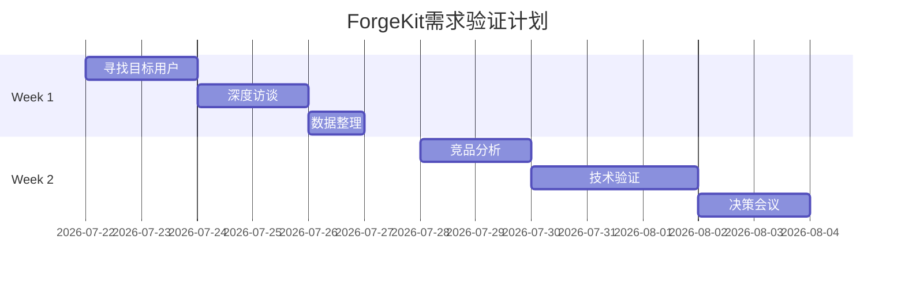

# ForgeKit 需求验证计划

> **文档版本**：v1.0  
> **制定日期**：2026-07-21  
> **执行周期**：2周  
> **决策者**：项目负责人  
> **执行者**：产品验证团队 / 开发者

---

## 一、待验证的两个定位

> 校准说明（2026-07-22）：原计划把“AI Agent 的 MCP 打包技能包”写成已确定定位，会造成确认偏差。根据 [项目方向决策](./DIRECTION_DECISION.md)，本轮必须同时验证两个价值主张，不能只询问支持性问题。

### 产品定位

```
假设 A：ForgeKit = AI Agent 的 MCP 打包技能包

假设 B：ForgeKit = 面向初学者和 AI Agent 的 Docker 构建诊断与验证助手

核心价值：
- AI Agent本身没有"打包"能力
- ForgeKit通过MCP协议，让Agent获得这个技能
- 就像给AI Agent装了一个"打包插件"

关键特性：
1. 规范性打包（符合各平台规范）
2. 多端兼容（Docker/npm/PyPI/未来移动端）
3. MCP原生集成（任何Agent都能用）
4. Plan-before-build（避免盲目构建）
```

---

### 目标用户

```
主要验证对象：
- 最近 30 天遇到过 Docker/BuildKit 构建失败的初中级开发者
- 需要交付 Agent、MCP Server 或小型服务，但缺少成熟发布平台的维护者
- 已使用 Codex、Claude Code、Cursor、Cline 等 Agent，并愿意用真实项目试用的人

相邻验证对象：
- MCP Server 维护者，用于判断安装与客户端配置是否构成共同问题

非核心对象：
- 已有成熟 CI/CD 且近期没有构建或交付失败的专家团队
- 只做本地实验、没有交付任务的研究项目

调用者：
- 开发者本人
- 通过 MCP 调用 ForgeKit 工具的 AI Agent
```

---

### 市场缺口

```
当前AI Agent能力分布：

✅ 已有能力：
- 自然语言理解（LLM）
- 代码生成（Claude Code, Cursor）
- 工具调用（MCP协议）
- 任务规划（ReAct, Plan-and-Execute）

❌ 缺失能力：
- "我的Agent开发完了，怎么部署给别人用？"
- "怎么把Agent打包成Docker镜像？"
- "怎么让用户安装我的Agent？"

ForgeKit填补的就是这个缺口
```

---

## 二、验证假设

### 核心假设

```
假设 A：AI Agent 开发者需要“打包技能”
假设 B：使用 Agent 构建 Docker 的开发者需要更清楚的失败诊断

验证问题：
1. AI Agent开发者现在怎么部署他们的Agent？
2. 他们遇到打包问题吗？
3. 他们愿意让Agent自己完成打包吗？
```

---

### 验证标准

| 结果 | 判断标准 | 后续行动 |
|------|----------|----------|
| **需求存在** | ≥3 人愿意用自己的项目试用，且至少 2 人完成第二次使用 | 继续开发胜出的价值主张 |
| **需求不确定** | 有口头兴趣，但没有人投入时间试用 | 继续验证，不增加产品范围 |
| **需求不存在** | 现有方案已满足，或试用后没有节省时间 | 停止该方向，保留技术成果 |

“说需要”只能作为线索，不能作为成功结论。优先记录过去真实行为、当前替代方案、试用完成和重复使用。

参与者按可区分的真实用户去重。同一 GitHub 账号提交的多个角色回答只能计为多条场景线索，不能重复计入访谈人数、试用人数或留存率。

---

## 三、验证计划（2周）

### Week 1：用户访谈（核心验证）

#### Day 1-2：目标用户寻找

**目标**：找到至少 10 名最近 30 天有 Docker 构建或交付任务的开发者，其中至少 5 名有明确失败经历、至少 3 名维护 Agent/MCP/服务项目。

**渠道**：

| 渠道 | 目标用户 | 寻找方式 |
|------|----------|----------|
| GitHub | AutoGPT贡献者 | 搜索contributors，看最近活跃的 |
| GitHub | BabyAGI用户 | 查看Issues和Discussions |
| GitHub | LangChain Agent开发者 | 搜索"langchain agent"仓库 |
| Discord | Claude Code用户 | 加入Claude Discord #general |
| Reddit | r/LocalLLaMA | 搜索"agent deployment"帖子 |
| Reddit | r/ArtificialIntelligence | 发帖询问 |
| Twitter | AI Agent开发者 | 搜索"I built an AI agent" |

**执行步骤**：

1. 打开GitHub，搜索以下仓库：
   - `github.com/Significant-Gravitas/AutoGPT`
   - `github.com/yoheinakajima/babyagi`
   - `github.com/langchain-ai/langchain`

2. 查看Contributors列表，找到最近活跃的开发者（3个月内有commit）

3. 阅读他们的个人简介，找到：
   - 开发过AI Agent的人
   - 关注Agent部署的人
   - 有公开邮箱或Twitter的人

4. 记录到用户列表：
   ```
   用户ID：xxx
   来源：AutoGPT贡献者
   状态：待联系
   联系方式：xxx@email.com / @twitter
   备注：最近在开发xxx Agent
   ```

---

#### Day 3-4：深度访谈

**目标**：完成至少5个深度访谈（30-60分钟）

**访谈问题清单**：

```markdown
# 第一部分：了解现状（10分钟）

1. 你最近在开发什么AI Agent？
   - 目的：做什么类型的Agent？
   - 技术栈：LangChain? AutoGPT? 自研？
   
2. 你的Agent现在能做什么？
   - 目的：理解Agent能力边界
   - 使用场景：开发辅助？自动化任务？

3. 你的Agent开发完后，怎么让别人用？
   - 部署方式：Docker？云端API？本地运行？
   - 分发方式：GitHub？npm？Docker Hub？

# 第二部分：挖掘痛点（15分钟）

4. 你在部署Agent时遇到过什么问题？
   - Docker构建失败？
   - 环境配置复杂？
   - 用户安装困难？
   - 版本管理混乱？

5. 你的用户怎么安装你的Agent？
   - 需要写详细文档？
   - 用户经常问安装问题？
   - 安装失败率高？

6. 你用过哪些部署工具？
   - GitHub Actions？
   - Docker？
   - Vercel/Render？
   - 其他？

7. 这些工具满足你的需求吗？
   - 缺少什么功能？
   - 配置复杂吗？
   - 需要手动干预吗？

# 第三部分：验证需求（15分钟）

8. 如果你的Agent能自己完成打包，你觉得怎么样？
   - 场景：你告诉Agent"帮我打包成Docker镜像"
   - Agent自动：分析项目 → 生成计划 → 构建镜像 → 推送仓库
   - 反应：愿意用？需要看看？不需要？

9. 如果有这样的MCP技能包，你会集成到你的Agent吗？
   - 价值：让Agent获得"打包能力"
   - 集成难度：配置MCP Server
   - 使用场景：什么时候会调用这个技能？

10. 你愿意试用一个"Agent打包技能包"吗？
    - 如果愿意：记录联系方式，后续提供测试版本
    - 如果不愿意：原因是什么？
```

---

#### Day 5：数据整理

**目标**：整理访谈数据，生成验证报告

**输出文档**：

```markdown
# 用户访谈汇总报告

## 1. 用户画像

| 用户ID | Agent类型 | 技术栈 | 当前部署方式 | 遇到的问题 |
|--------|-----------|--------|--------------|-----------|
| U001 | 自动化Agent | AutoGPT | Docker | Dockerfile配置复杂 |
| U002 | 代码Agent | LangChain | 云端API | 用户安装困难 |
| U003 | ... | ... | ... | ... |

## 2. 痛点统计

| 痛点类型 | 提及次数 | 严重程度 |
|----------|----------|----------|
| Docker构建失败 | 3/5 | 高 |
| 环境配置复杂 | 4/5 | 高 |
| 用户安装困难 | 2/5 | 中 |
| ... | ... | ... |

## 3. 需求验证

| 用户ID | 是否愿意用Agent自己打包 | 意愿强度 | 备注 |
|--------|------------------------|----------|------|
| U001 | 愿意 | 强 | "这个很有用" |
| U002 | 需要看看 | 中 | "要看具体实现" |
| U003 | 不需要 | - | "我手动打包就够了" |
| ... | ... | ... | ... |

## 4. 关键发现

- 发现1：...
- 发现2：...
- 发现3：...

## 5. 建议

- 建议1：...
- 建议2：...
```

---

### Week 2：竞品分析与技术验证

#### Day 6-7：竞品深度分析

**目标**：理解现有工具的优缺点

**分析对象**：

```
1. mcp-server-docker (732 stars)
   - 分析：README价值主张
   - 分析：前50个Issues分类
   - 分析：用户讨论内容
   
2. LangChain部署方案
   - 官方推荐：怎么部署LangChain Agent
   - 社区实践：搜索"langchain deployment"
   
3. AutoGPT部署实践
   - 官方文档：怎么部署AutoGPT
   - 用户实践：Issues中的部署问题

4. Docker Hub上的AI Agent
   - 搜索："ai agent", "chatbot", "llm"
   - 分析：他们怎么写Dockerfile
   - 发现：常见配置模式
```

**输出文档**：

```markdown
# 竞品分析报告

## 1. mcp-server-docker分析

### 价值主张
- ...

### 用户痛点（Issues分类）
- 安全问题：X个
- 功能缺失：Y个
- 文档不足：Z个

### 他们的弱点
- ...

## 2. 其他部署工具分析

### LangChain官方方案
- ...

### AutoGPT部署实践
- ...

## 3. 差异化机会

- 机会1：...
- 机会2：...
```

---

#### Day 8-10：技术可行性验证

**目标**：验证当前技术是否能满足用户需求

**验证项**：

| 验证项 | 方法 | 预期结果 | 实际结果 |
|--------|------|----------|----------|
| Agent能否调用ForgeKit | 用Claude Code配置MCP Server | 能成功调用6个工具 | 待测试 |
| Agent能否理解错误提示 | 制造错误，看Agent反应 | Agent能理解并修正 | 待测试 |
| Agent能否完成完整打包流程 | 让Agent打包一个项目 | 能完成inspect→plan→build | 待测试 |

**测试步骤**：

```bash
# 测试1：Agent调用ForgeKit

1. 在Claude Desktop配置ForgeKit MCP Server
2. 让Agent执行："分析当前项目的打包需求"
3. 观察Agent是否能成功调用inspect_project
4. 记录Agent的反应和输出

# 测试2：Agent理解错误提示

1. 制造错误：删除Dockerfile
2. 让Agent执行："构建Docker镜像"
3. 观察Agent是否能理解"plan_not_found"错误
4. 记录Agent是否知道要调用generate_packaging_plan

# 测试3：完整打包流程

1. 提供一个测试项目（Python或Node.js）
2. 让Agent执行："帮我打包这个项目成Docker镜像"
3. 观察Agent是否能：
   - 先调用inspect_project分析项目
   - 再调用generate_packaging_plan生成计划
   - 最后调用build_docker_image构建镜像
4. 记录完整流程的成功率
```

---

#### Day 11-12：决策会议

**目标**：根据验证结果决定下一步

**决策框架**：

```
┌─────────────────────────────────────────────────────────────┐
│                       决策树                                 │
├─────────────────────────────────────────────────────────────┤
│                                                             │
│  Week 1访谈结果：                                            │
│  ├─ ≥3个用户愿意用 → 继续验证技术可行性                       │
│  │   └─ 技术可行 → 进入产品迭代                              │
│  │   └─ 技术不可行 → 技术攻关                                │
│  │                                                          │
│  └─ <3个用户愿意用 → 分析原因                                │
│      ├─ 问题是"不知道有这个需求" → 市场教育                   │
│      ├─ 问题是"现有方案够用" → 差异化不足，停止               │
│      └─ 问题是"市场未成熟" → 保留技术，等待时机              │
│                                                             │
└─────────────────────────────────────────────────────────────┘
```

**输出文档**：

```markdown
# 验证结果决策报告

## 验证数据

### 用户访谈结果
- 访谈人数：X人
- 愿意试用：Y人（Y/X = XX%）
- 明确不需要：Z人

### 技术验证结果
- Agent能调用ForgeKit：是/否
- Agent能理解错误：是/否
- 完整流程成功率：XX%

## 决策建议

### 场景A：需求明确存在
- 建议：继续开发
- 下一步：产品迭代计划

### 场景B：需求不明确
- 建议：继续验证
- 下一步：扩大访谈范围

### 场景C：需求不存在
- 建议：停止开发
- 下一步：保留技术成果，等待市场成熟
```

---

## 四、成功标准

### 定量标准

| 指标 | 目标 | 当前 | 状态 |
|------|------|------|------|
| 访谈AI Agent开发者数量 | ≥10人 | 0人 | ⏳ 待执行 |
| 愿意试用的开发者数量 | ≥3人 | 0人 | ⏳ 待执行 |
| Agent能成功调用ForgeKit | 100% | 未测试 | ⏳ 待执行 |
| 完整打包流程成功率 | ≥80% | 未测试 | ⏳ 待执行 |

---

### 定性标准

| 标准 | 判断依据 |
|------|----------|
| 用户痛点真实 | 开发者主动描述打包问题 |
| 解决方案有价值 | 开发者愿意试用或推荐 |
| 技术可行 | Agent能理解并完成打包流程 |

---

## 五、所需资源

### 人力

| 角色 | 时间投入 | 任务 |
|------|----------|------|
| 访谈执行者 | Week 1全时 | 寻找用户、访谈、整理数据 |
| 技术验证者 | Week 2半时 | 测试Agent调用、记录结果 |
| 决策者 | Day 12半天 | 参与决策会议 |

---

### 工具

| 工具 | 用途 |
|------|------|
| GitHub | 寻找目标用户 |
| Discord/Reddit/Twitter | 联系用户 |
| 录音工具 | 记录访谈内容 |
| 文档工具 | 整理访谈数据 |
| Claude Desktop | 测试Agent调用 |

---

### 预算（可选）

| 项目 | 预算 | 用途 |
|------|------|------|
| 用户激励 | ¥500-1000 | 给访谈用户发红包/礼品卡 |
| 测试环境 | ¥200 | 云服务器测试Docker构建 |

---

## 六、风险与应对

### 风险1：找不到足够的AI Agent开发者

**应对**：
- 扩大搜索范围（从GitHub扩展到Discord/Reddit/Twitter）
- 降低访谈人数要求（从10人降到5人）
- 询问被访谈者能否推荐其他人

---

### 风险2：用户说"不需要"

**应对**：
- 深挖原因：是"现有方案够用"还是"不知道有这个需求"
- 展示Demo：让用户看到Agent自己打包的效果
- 记录反对意见：用于产品方向调整

---

### 风险3：Agent无法理解ForgeKit的错误提示

**应对**：
- 优化错误提示：让Agent更容易理解
- 增加文档：给Agent看的示例
- 技术攻关：研究怎么让Agent更好地理解工具

---

## 七、时间表



---

## 八、输出文档清单

### Week 1输出

| 文档 | 内容 | 负责人 |
|------|------|--------|
| 用户列表.md | 目标用户联系方式 | 执行者 |
| 访谈记录.md | 每个用户的访谈记录 | 执行者 |
| 用户访谈汇总报告.md | 数据整理和分析 | 执行者 |

---

### Week 2输出

| 文档 | 内容 | 负责人 |
|------|------|--------|
| 竞品分析报告.md | 现有工具分析 | 执行者 |
| 技术验证报告.md | Agent调用测试结果 | 技术验证者 |
| 验证结果决策报告.md | 最终决策建议 | 决策者 |

---

## 九、执行者行动清单

### 立即开始（Day 1）

```bash
□ 创建用户列表文档
□ 打开GitHub，搜索AutoGPT、BabyAGI、LangChain仓库
□ 找到5个最近活跃的贡献者
□ 记录他们的联系方式到用户列表
```

---

### Week 1每日检查

```bash
□ 今日找到多少个目标用户？
□ 今日完成多少个访谈？
□ 访谈中发现什么新痛点？
□ 记录到访谈记录文档
```

---

### Week 2每日检查

```bash
□ 今日分析了哪些竞品？
□ 今日测试了哪些技术点？
□ 测试结果记录了吗？
□ 准备决策会议了吗？
```

---

## 十、联系方式

**有问题联系**：

- 方向决策者：[项目负责人]
- 技术支持：[技术负责人]

---

## 附录：访谈模板

### 访谈邀请语

```
主题：关于AI Agent部署的访谈邀请

你好 [用户名]，

我注意到你在开发 [Agent名称]，觉得很有意思。

我们正在做一个"帮助AI Agent获得打包能力"的工具，想听听你的真实需求。

如果你愿意，我们可以聊聊：
- 你的Agent现在怎么部署？
- 遇到过什么问题？
- 你觉得"Agent自己完成打包"怎么样？

访谈时间：30-60分钟
访谈方式：线上（Zoom/腾讯会议）

如果你愿意，回复这个邮件/私信即可。

谢谢！
[你的名字]
```

---

### 访谈记录模板

```markdown
# 用户访谈记录

**用户ID**：U001  
**访谈时间**：2026-07-22 14:00-15:00  
**访谈方式**：Zoom  

## 基本信息

- Agent名称：xxx
- Agent类型：自动化Agent
- 技术栈：AutoGPT + LangChain
- 用户规模：个人项目，10+用户

## 部署现状

- 当前部署方式：Docker Hub
- 部署频率：每次发布新版本
- 用户安装方式：docker pull + 配置文件

## 痛点

1. Dockerfile配置复杂
   - 每次要花2小时写Dockerfile
   - 经常遇到构建失败
   
2. 用户安装困难
   - 用户经常问"怎么安装"
   - 需要写详细的文档

3. 版本管理混乱
   - 不知道用户用的是哪个版本
   - 没有追溯能力

## 对"Agent自己打包"的态度

- 反应："这个想法不错"
- 愿意试用：是
- 使用场景："每次发布新版本时，让Agent自己打包"

## 其他发现

- 用户提到："如果Agent能自动推送到Docker Hub就更好了"
- 用户提到："希望有Release Notes自动生成"

## 后续行动

- [ ] 发送试用版本给用户
- [ ] 收集使用反馈
```

---

**文档结束**

---

**执行者须知**：

1. 严格按照时间表执行
2. 每天记录进度到项目群
3. 发现问题立即反馈
4. 诚实记录数据，不美化结果
5. 最终目标是验证需求是否真实存在

---

**决策者须知**：

1. Week 2结束时必须做出决策
2. 决策标准：定量数据 + 定性判断
3. 如果需求不存在，诚实承认，不要继续投入
4. 如果需求存在，制定下一步产品迭代计划

---

**祝验证顺利！**
